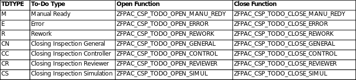
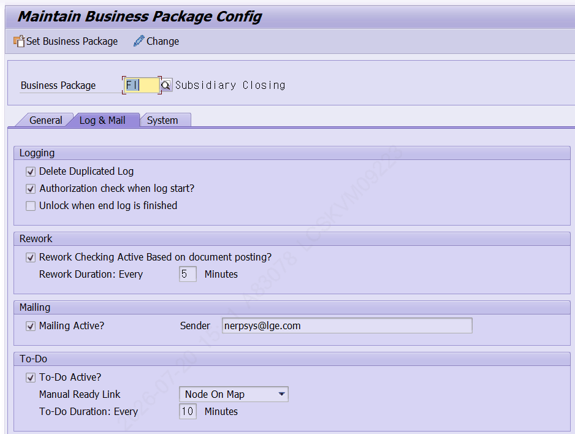
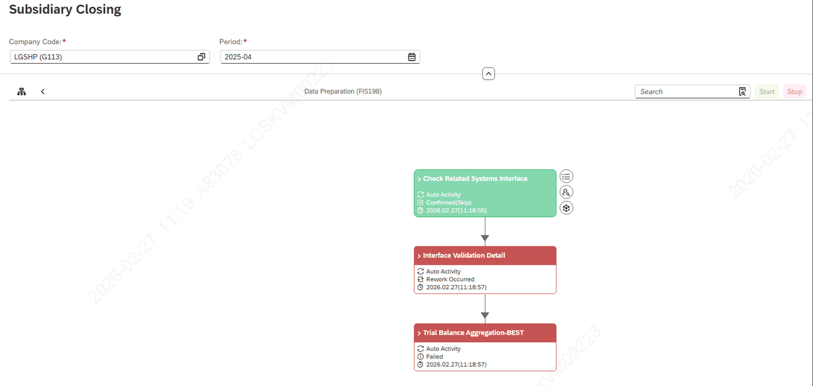
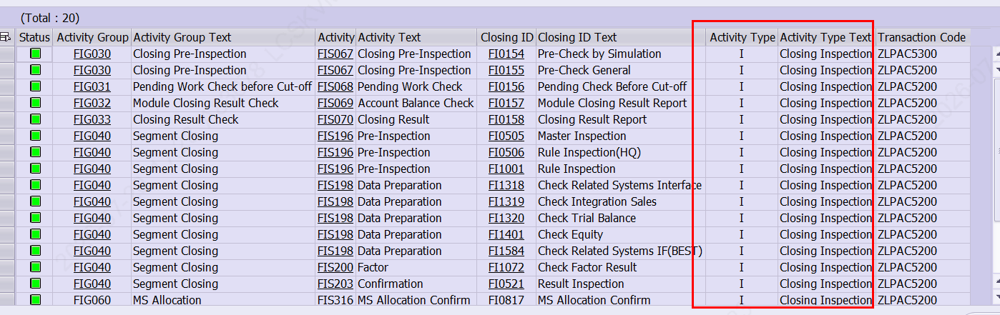
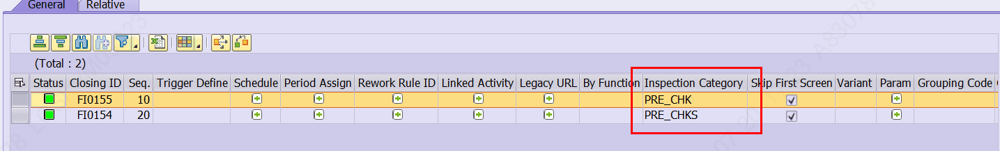

# 2. 유형별 To-Do 프로세스

## 2.1 To-Do 유형과 Open / Close Function 체계

To-Do는 발생(Open) 시 ZFPAC_OPEN_TODO, 종료(Close) 시 ZFPAC_CLOSE_TODO를 통해 처리되며, 두 함수는 모두 To-Do 유형(TDTYPE) 값에 따라 내부에서 유형별 처리로 분기합니다. 유형별 코드는 다음과 같습니다.

| TDTYPE | To-Do 유형 | 설명 |
|---|---|---|
| E | Error | Activity 수행 중 오류 발생 |
| M | Manual Ready | 수동 완료가 필요한 항목 |
| R | Rework | 완료 항목에 재작업 필요 발생 |
| CN | Closing Inspection General | 결산 점검 - 일반 |
| CC | Closing Inspection Controller | 결산 점검 - Controller |
| CR | Closing Inspection Reviewer | 결산 점검 - Reviewer |
| CS | Closing Inspection Simulation | 결산 점검 - Simulation |

[그림 2-1] 유형(TDTYPE)별 Open / Close Function 매핑

> ✔ 시스템 확인 ZFPAC_OPEN_TODO / ZFPAC_CLOSE_TODO 는 함수 그룹 ZPAC260(패키지 ZPAC)에 존재합니다. 두 함수의 IMPORTING 파라미터 IV_TYPE(데이터 엘리먼트 ZPAC_TODO_TYPE)의 분기 값이 위 7종(E/M/R/CN/CC/CR/CS)과 일치함을 소스에서 확인했습니다. 발생 전제 조건: 대상 Business Package의 ZTPAC_CONFIG-XTODO 값이 'X'(To-Do 사용)여야 합니다.

## 2.2 결산 일정 배포 시 감지 배치 생성

Rework 감지 배치는 매월 결산 일정 배포(ZLPAC7100의 Distribute) 시점에 생성됩니다. 이 배치가 주기적으로 돌면서 재작업 대상을 감지하여 Rework To-Do를 발송합니다. Manual Ready는 배치 주기마다 별도의 함수가 대상을 감지하여 발송합니다.

> ✔ 시스템 확인 ZLPAC7100(Distribute Closing Schedule) 배포 시 호출되는 Rework 배치 생성 로직은 ZCL_PAC_SAIL=>CREATE_REWORK_BUPAK_JOB 이며, 실행 리포트는 ZLPAC7191('Rework All Closing Check - Batch Session')입니다. 대상은 ZTPAC_CONFIG 에서 XREWORK='X' 이면서 (PACLVL='C' 또는 REQ_BUKRS='X')인 Business Package이고, Job 명은 [PAC]REWORK(BusPkg)_년/월 형식으로 생성됩니다. (소스 확인) Manual Ready 대상 감지는 함수 ZFPAC_GET_MREADY_PID(함수 그룹 ZPAC280, 'Get Manual Ready PAC ID List')가 담당합니다.

## 2.3 Error To-Do (TDTYPE = 'E')

Error To-Do는 배치를 기다리지 않고 오류 발생 즉시 발송됩니다. Activity 상태가 변경(오류)되는 지점인 ZCL_PAC=>UPDATE_PAC_STATUS에서 To-Do 발송이 함께 호출됩니다.

## 2.4 Manual Ready To-Do (TDTYPE = 'M')

Manual Ready로 받아야 할 To-Do는 배치가 일정 주기로 돌면서 감지하여 발송합니다. 감지 주기(Duration)는 ZLPAC0010(Business Package Config)의 배치 설정값으로 관리됩니다.

[그림 2-2] ZLPAC0010 — Rework Duration / To-Do Duration 설정 (Log & Mail 탭)

- To-Do Duration : Manual Ready 감지 배치의 주기입니다.
- Rework Duration : Rework 감지 배치의 주기입니다.

> ✔ 시스템 확인 ZLPAC0010 = 'Maintain Business Package Config' 로 확인했습니다. Rework 감지 배치의 주기값은 ZTPAC_CONFIG-RWTMOUT(분) 필드에서 읽어 다음 실행 시각을 계산합니다. (CREATE_REWORK_BUPAK_JOB 소스 확인) 감지 주기는 운영 환경에서 조정 가능한 설정값이므로, 실제 적용값은 ZLPAC0010에서 확인하십시오.

> ⚠ 주의 감지 주기(Duration)를 지나치게 짧게 설정하면 배치가 과도하게 반복 수행되어 시스템 부하가 커질 수 있습니다. 주기 변경은 운영 담당자와 협의 후 신중히 적용하십시오.

## 2.5 Rework To-Do (TDTYPE = 'R')

Rework 감지 배치가 재작업 대상을 감지하면, 해당 항목의 Activity가 'Rework Occurred'로 변경되면서 조치를 요청하는 Rework To-Do가 함께 발송됩니다.

[그림 2-3] Rework 감지 시 Activity가 'Rework Occurred'로 변경된 화면

## 2.6 Closing Inspection To-Do (TDTYPE = 'CN' / 'CC' / 'CR' / 'CS')

Closing Inspection 수행 중 오류가 발생하면 점검 유형에 맞는 To-Do가 발송됩니다. 발송이 이루어지려면 Activity Master에 Activity Type이 'I'(Closing Inspection)로 지정되어 있고, Inspection Category가 정상적으로 등록되어 있어야 합니다.

[그림 2-4] Activity Type이 'I'(Closing Inspection)로 등록된 Activity 목록

[그림 2-5] Activity에 등록된 Inspection Category (예: PRE_CHK / PRE_CHKS)

## 2.7 To-Do 종료(Close) 규칙

ZFPAC_CLOSE_TODO는 유형에 따라 종료 대상 범위(사용자 지정 필요 여부)가 다릅니다.

| 유형 | 종료(Close) 규칙 |
|---|---|
| R, E | 전체 종료 (User 지정 불필요) |
| CN, CS, CC | 전체 종료 (User 지정 불필요) |
| M (일반) | 전체 종료 (User 지정 불필요) |
| M (Individual) | User 필수 (미지정 시 실행 User로 처리) |
| CR | User 미지정 시 해당 시나리오 전체 종료 / User 지정 시 해당 User만 종료 |

> ✔ 시스템 확인 위 종료 규칙은 ZFPAC_CLOSE_TODO 소스의 처리 분기 주석 및 로직에서 확인한 내용입니다. 종료 시 대상 Open 내역은 To-Do 상태 테이블(ZTPAC_TODO_STU)의 TDKEY / SEQ 기준으로 조회하여 처리합니다.
