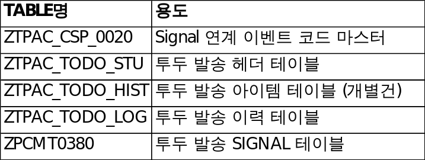

# 3. To-Do 관련 테이블

To-Do 발생·종료·이력 및 Signal 연계에 사용되는 주요 테이블은 다음과 같습니다.

[그림 3-1] To-Do 관련 테이블 구성

| 테이블 | 용도 |
|---|---|
| ZTPAC_CSP_0020 | To Do Event Code Master — Signal 연계 시 사용하는 이벤트 코드 마스터 |
| ZTPAC_TODO_STU | To-Do 발송 헤더 테이블 (To Do Status) |
| ZTPAC_TODO_HIST | To-Do 발송 아이템 테이블 (개별 수신 건, To Do History) |
| ZTPAC_TODO_LOG | To-Do 발송 이력 테이블 |
| ZPCMT0380 | To-Do 발송 Signal 테이블 (Signal 측) |

> ✔ 시스템 확인 ZTPAC_TODO_STU('To Do Status')는 TDKEY·SEQ를 Key로 하며 BUPAK/조직/PID/TDTYPE/TODO_STATUS/EVTNR/MSGGROUP/PACKETID/FINAL 등을 보관함을 확인했습니다. ZTPAC_TODO_HIST('To Do History')는 TDKEY·SEQ·EMPNO·BNAME을 Key로 하는 개별 수신 건 테이블임을 확인했습니다. ZPCMT0380 은 이 시스템에 존재하지 않아 Signal 측 테이블로 확인됩니다.

## 3.1 To Do Event Code Master (ZTPAC_CSP_0020)

Signal 연계 시 사용하는 이벤트 코드 마스터로, To-Do 카테고리별로 이벤트 번호(EVTNR)·이벤트 ID(EVTID)·메시지 그룹(MSGGROUP)·To-Do 유형(TDTYPE)이 매핑됩니다.

| TDCATG | IDV | EVTNR | EVTID | MSGGROUP | TDTYPE |
|---|---|---|---|---|---|
| CIS_CONTROLLER |  | 0000000036 | FCW0000037 | 001 | CC |
| CIS_GENERAL |  | 0000000033 | FCW0000034 | 001 | CN |
| CIS_REVIEWER |  | 0000000037 | FCW0000038 | 001 | CR |
| CIS_SIMUL |  | 0000000033 | FCW0000034 | 001 | CS |
| ERROR |  | 0000000057 | FCW0000058 | 001 | E |
| MANUAL_READY |  | 0000000032 | FCW0000033 | 002 | M |
| MANUAL_READY | X | 0000000032 | FCW0000033 | 001 | M |
| REWORK |  | 0000000039 | FCW0000040 | 001 | R |

IDV(IDV_FLAG)는 Manual Ready의 Individual 항목에 'X'로 표기하는 필드로, Individual 건만 별도의 이벤트로 발생시킵니다.

> ✔ 시스템 확인 이벤트 코드 마스터에 대응하는 EVTNR·MSGGROUP·TDTYPE 필드가 To-Do 헤더/이력 테이블(ZTPAC_TODO_STU / ZTPAC_TODO_HIST)에 실제로 존재함을 확인했습니다. 위 이벤트 코드 값 표는 운영 시스템의 마스터 등록 화면에서 캡처한 내용입니다.
