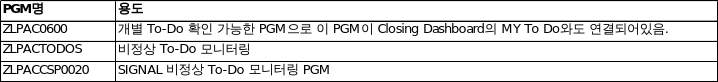
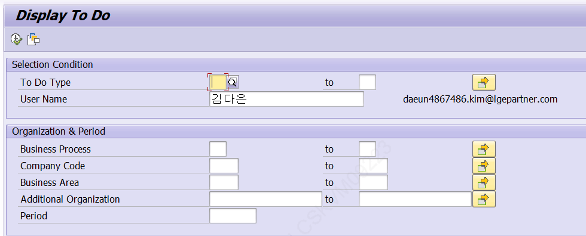
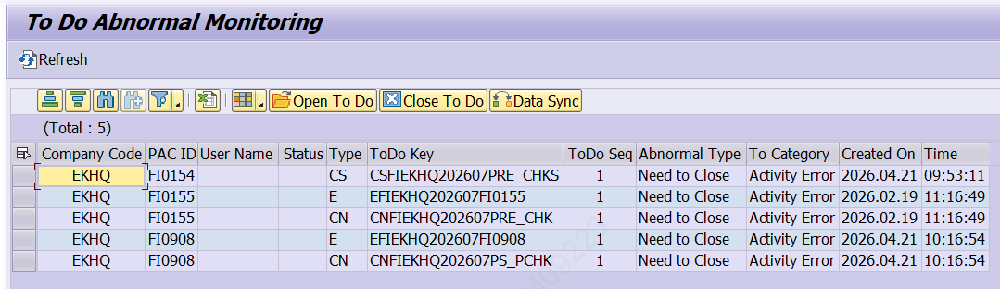
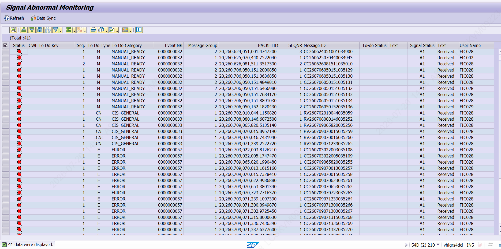

# 4. To-Do 관련 프로그램

[그림 4-1] To-Do 관련 주요 프로그램

## 4.1 ZLPAC0600 — Display To Do

개별 To-Do를 조회할 수 있는 프로그램입니다. 이 프로그램은 Closing Dashboard의 My To Do와도 연결되어 있습니다. To Do Type, User Name, 조직/기간 조건으로 발생한 To-Do를 조회합니다.

[그림 4-2] ZLPAC0600 — Display To Do 조회 조건 화면

> ✔ 시스템 확인 ZLPAC0600 = 'Display To Do' 로 확인했습니다.

## 4.2 ZLPACTODOS — To Do Abnormal Monitoring

발생해야 했으나 발생하지 않은 To-Do 등 비정상 To-Do 내역을 모니터링하는 프로그램입니다. 화면에서 Open To Do / Close To Do / Data Sync 기능을 제공합니다.

[그림 4-3] ZLPACTODOS — To Do Abnormal Monitoring

> ⚠ 주의 ZLPACTODOS의 Open To Do / Close To Do / Data Sync 는 무조건 실행하면 안 됩니다. 반드시 대상 내역을 검토한 뒤 Open/Close 또는 Data Sync를 진행하십시오. 검토 없이 실행하면 To-Do 상태가 실제와 어긋날 수 있습니다.

> ✔ 시스템 확인 ZLPACTODOS = 'To Do Abnormal Monitoring' 으로 확인했습니다.

## 4.3 ZLPACCSP0020 — Signal Abnormal Monitoring

Signal과 CWF To-Do 간 싱크가 맞지 않는 건을 조회하는 프로그램입니다. 예를 들어 CWF에는 있는데 Signal에는 없거나, 반대로 CWF에는 없는데 Signal에는 있는 경우가 대상입니다.

[그림 4-4] ZLPACCSP0020 — Signal Abnormal Monitoring
