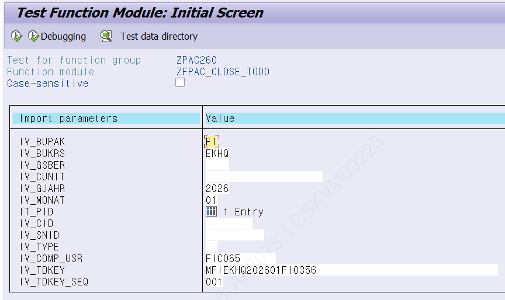
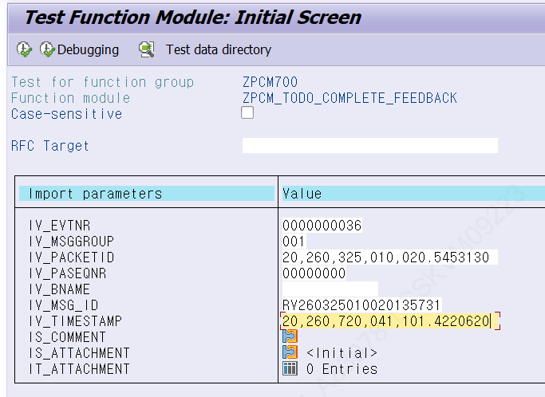
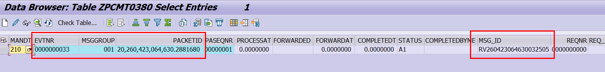

# 5. 미완료 To-Do 처리 방법

정상적으로 닫혀야 할 To-Do가 닫히지 않은 경우, 강제로 종료해야 할 수 있습니다. 강제 종료 방법은 PAC 측 함수를 사용하는 경우와 Signal 측 함수(ZPCM_TODO_COMPLETE_FEEDBACK)를 사용하는 경우로 나뉩니다.

## 5.1 ZFPAC_CLOSE_TODO (PAC 측 종료)

To-Do가 닫혀야 하는데 닫히지 않았고, ZLPACTODOS 목록에도 나타나지 않는 경우 이 함수로 종료합니다. 이 함수로 종료하면 CWF와 Signal의 Close 로직을 동시에 호출합니다.

[그림 5-1] ZFPAC_CLOSE_TODO — 강제 종료 시 입력 파라미터 (함수 그룹 ZPAC260)

> ✔ 시스템 확인 ZFPAC_CLOSE_TODO(함수 그룹 ZPAC260)는 IV_BUPAK / IV_BUKRS / IV_GSBER / IV_CUNIT / IV_GJAHR / IV_MONAT / IT_PID / IV_TYPE / IV_COMP_USR / IV_TDKEY / IV_TDKEY_SEQ 파라미터를 가짐을 확인했습니다. IV_TYPE 미입력 시 IV_TDKEY·IV_TDKEY_SEQ로 ZTPAC_TODO_STU에서 TDTYPE을 조회하여 처리합니다.

## 5.2 ZPCM_TODO_COMPLETE_FEEDBACK (Signal 측 종료)

CWF To-Do는 닫혔는데 Signal To-Do만 열려 있는 경우 사용합니다. 즉 동일한 PACKETID에 대해 CWF To-Do 테이블의 Status는 'C'(닫힘)인데 Signal To-Do 테이블에는 'A1'(열림)으로 남아 있는 경우입니다.

종료를 위해서는 아래 파라미터를 모두 입력해야 합니다. Signal To-Do 테이블(ZPCMT0380)에서 종료하려는 PACKETID의 정보(EVTNR / MSGGROUP / PACKETID / PASEQNR / MSG_ID 등)를 조회하여 파라미터로 입력합니다.

[그림 5-2] ZPCM_TODO_COMPLETE_FEEDBACK — 입력 파라미터 (Signal 측 함수)

[그림 5-3] ZPCMT0380 — 파라미터 조회를 위한 Signal To-Do 테이블

- IV_TIMESTAMP 값은 다음 로직으로 추출할 수 있습니다: DATA LV_TIMESTAMP TYPE TIMESTAMPL. GET TIME STAMP FIELD LV_TIMESTAMP.

> ✔ 시스템 확인 ZPCM_TODO_COMPLETE_FEEDBACK 및 테이블 ZPCMT0380 은 현재 PAC 시스템에 존재하지 않아 Signal 측(외부) 객체로 확인됩니다. 따라서 본 함수 사용은 Signal 연계 담당과 협의하여 진행하십시오.

> ⚠ 주의 강제 종료는 To-Do 상태를 직접 변경하는 작업입니다. 대상 PACKETID와 조직/기간을 반드시 재확인한 뒤 실행하고, 가능하면 사전에 대상 내역을 캡처·기록하십시오.
